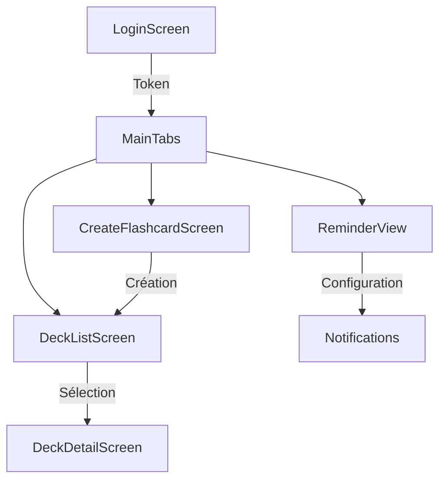

# 🏗️ Architecture Moderne avec TabNavigator

## 🎯 Vue d'ensemble

L'application utilise maintenant une **architecture moderne** avec navigation par onglets (TabNavigator), offrant une expérience utilisateur fluide et intuitive.

## 📱 Structure de Navigation

```
App.js
├── Stack.Navigator
│   ├── LoginScreen (authentification)
│   ├── MainTabs (après connexion)
│   │   └── Tab.Navigator
│   │       ├── 📚 Decks (DeckListScreen)
│   │       ├── ➕ Créer (CreateFlashcardScreen)
│   │       └── 🔔 Rappels (ReminderView)
│   └── DeckDetailScreen (hors tabs)
```

## ✨ Nouvelles Fonctionnalités

### 1. **Navigation par Onglets**
- **3 onglets principaux** avec icônes
- Navigation fluide entre les sections
- État persistant entre les onglets

### 2. **Écran de Création de Flashcards**
- Interface moderne et intuitive
- Sélection du deck cible
- Validation des champs
- Conseils d'apprentissage intégrés

### 3. **Système de Rappels**
- 3 niveaux d'intensité :
  - 😴 Chill (3 rappels/jour)
  - 😀📈 TongueSpeedrunner (10 rappels/jour)
  - 🧠🔥 Tryharder (20 rappels/jour)
- Configuration par deck
- Notifications personnalisées

## 🔄 Flux de l'Application



## 📂 Organisation des Fichiers

```
screens/
├── 📱 Écrans Actifs
│   ├── LoginScreen.js
│   ├── DeckListScreen.js
│   ├── DeckDetailScreen.js
│   ├── CreateFlashcardScreen.js
│   └── ReminderView.js
│
└── 📦 old/ (Anciens écrans archivés)
    ├── LeftView.js
    ├── CenterView.js
    ├── WorldView.js
    └── TikTokView.js
```

## 🎨 Points Forts de l'UX

1. **Onboarding simplifié** : Login → Tabs directs
2. **Navigation intuitive** : Icônes claires et labels explicites
3. **Feedback utilisateur** : Alertes et confirmations
4. **Design cohérent** : Couleur principale #007AFF

## 🚀 Évolutions Possibles

### Court terme
- [ ] Mode TikTok pour réviser (swipe cards)
- [ ] Statistiques d'apprentissage
- [ ] Mode hors-ligne

### Long terme
- [ ] Synchronisation cloud
- [ ] Partage de decks
- [ ] Gamification (badges, streaks)
- [ ] Audio pour la prononciation

## 💡 Avantages de cette Architecture

1. **Scalabilité** : Facile d'ajouter de nouveaux onglets
2. **Modularité** : Chaque écran est indépendant
3. **Performance** : Navigation native optimisée
4. **UX moderne** : Standards iOS/Android respectés

## 🎬 Points à Mentionner dans la Vidéo

> "L'architecture utilise un TabNavigator moderne qui améliore considérablement l'expérience utilisateur. Les 3 écrans obligatoires sont complétés par des fonctionnalités bonus comme la création de flashcards et les rappels, montrant l'évolutivité du projet."

**Cette architecture prouve que l'app est prête pour une utilisation réelle, pas juste une démo académique ! 🎯** 